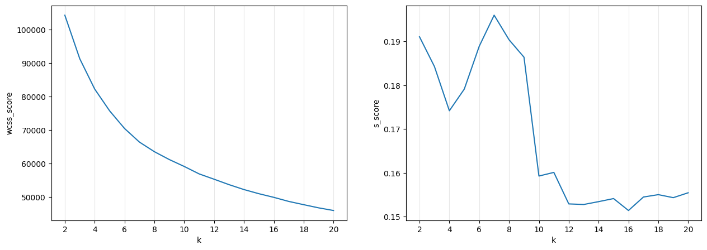
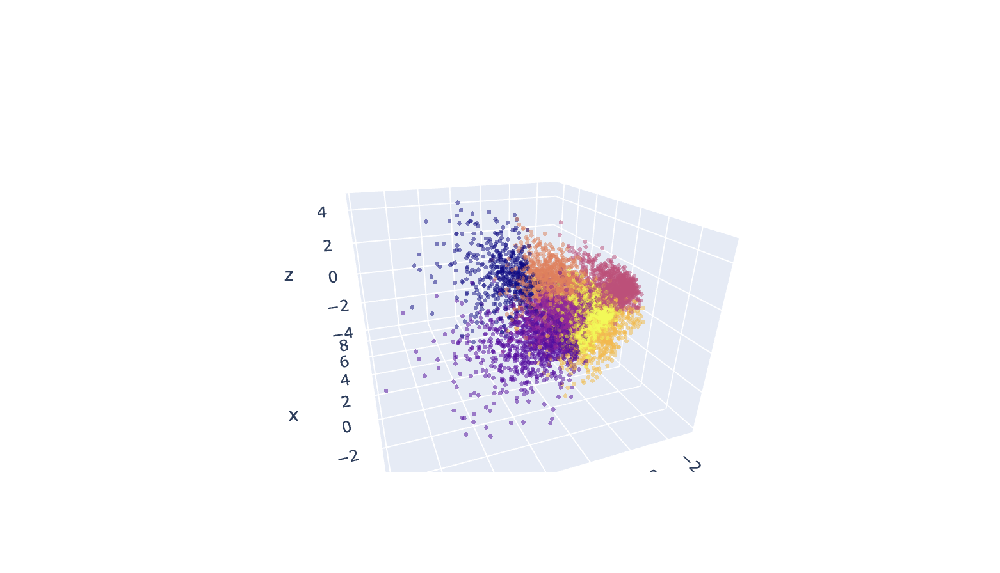
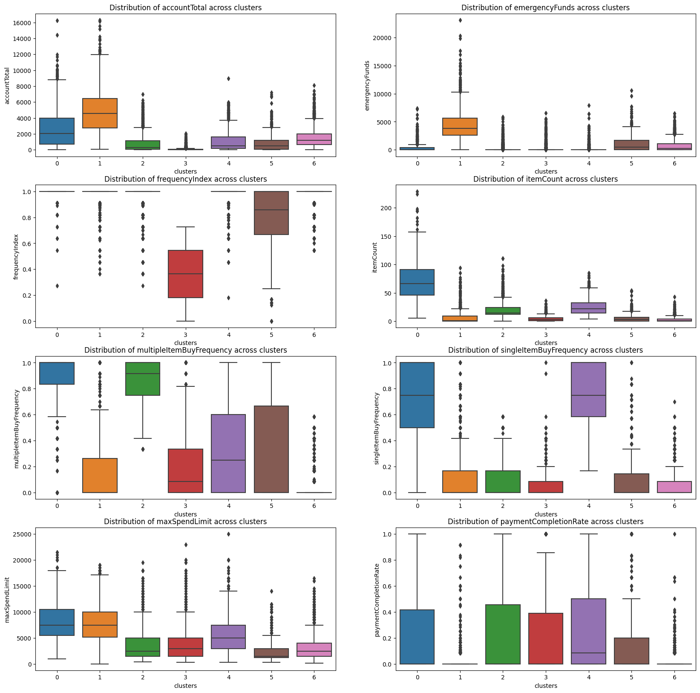

# Artificial Intelligence and Machine Learning 2023/2024 Group Project

**Dataset:** ShopEasy

**Group Members:**

- Yassir El Arrag (281721)
- Leonardo Farfan (285911)
- Shefik Memedi (286861)

## Introduction

The ShopEasy AI Project focuses on analyzing the purchasing patterns and behaviors of users on the ShopEasy platform. The primary objective of this project is to develop a model that segments and groups customers based on their data.

## Methods

Our project is divided in three stages:

1. **Exploratory Data Analysis:** In this section of the project, we explore the dataset, check for missing values and impute them, and check for duplicated rows. Then, we proceed to analyze the features through univariate analysis and bivariate analysis. Also in this section, we pre-process the data, removing categorical variables for our clustering models.

2. **Clustering Models:** For this section, we explore K-Means, Hierarchical Clustering and DBSCAN. We analyze the performance of these models through WCSS and Silhouette Score, and we use PCA to reduce the dimensions of the dataset for visualization purposes. We plot the clusters in 2D and 3D plots (only visible by running the notebook locally). Finally, we create a custom solution, which we believe will help us perform a more effective analysis, by combining DBSCAN and K-Means.

3. **Cluster Analysis:** We analyze the results of DBSCAN+K-Means through boxplots for the most important features of the dataset.

## Experimental Design

In this project, we run extensive testing in order to find the best parameters for our models, through WCSS only for K-Means, and Silhouette Score to measure individually the performances of all three models (and to adjust the parameters).

We also compare K-Means and Hierarchical Clustering with the ARI index, in order to see the agreement between the two models.

Finally, we decided to combine DBSCAN and K-Means with the objective of improving the analysis phase. We used DBSCAN to remove some of the noise/outliers from the dataset, and then K-Means to find the clusters. This procedure allowed us to explore more easily the similarities between the members of the clusters.

Another important statistical tool that we used during the project is PCA for dimensionality reduction. This allowed us to visualize in two and three dimensions our results, preserving all of the information of the dataset (even when it contains 18 features).

The usage of 3D plots allows for a better understanding of the cluster definition, explaining overlaps in 2-dimensions.

**Important:** In order to visualize the 3D plots interactivelly, it is necessary to run the notebook locally, loading the environment and executing the notebook (expect ~7 minutes to run).

## Results

The project tested three clustering algorithms: K-Means, Hierarchical Clustering, and DBSCAN. Each algorithm's performance was evaluated to determine the most effective method for customer segmentation.

DBSCAN was effective in identifying and excluding noise, which helped in refining the clustering results obtained from other methods. By removing outliers identified by DBSCAN, the K-Means clustering results were further refined, leading to more homogeneous and interpretable clusters.

The final clusters provided actionable insights for ShopEasy:

- **Customer Segments**: The analysis identified distinct customer segments with specific purchasing behaviors and preferences.
- **Targeted Marketing**: These segments can be used to tailor marketing campaigns and promotions, enhancing customer engagement and satisfaction.
- **Improved User Experience**: By understanding the unique characteristics of each segment, ShopEasy can offer personalized recommendations and services, improving the overall user experience.

## Conclusions

Based on the insights from the cluster analysis of user behavior on the ShopEasy e-commerce platform, several targeted marketing strategies are recommended to enhance user engagement and retention:

1. **Cluster 0 and Cluster 1**: Users in these clusters exhibit high frequency and spending. Implementing loyalty programs and exclusive offers will likely enhance their engagement and encourage continued patronage.

2. **Cluster 6**: This cluster prefers high-value items. Introducing premium services such as extended warranties can incentivize further spending and enhance user satisfaction.

3. **Cluster 5**: Users in this cluster are more budget-conscious. Adjusting product offerings and pricing strategies to include more budget-friendly options could increase transaction volumes.

4. **Cluster 0**: Expanding flexible payment options, particularly installment plans, can cater to the spending preferences of users in this cluster, making high-value purchases more accessible.

5. **Clusters 4 and 5**: These clusters consist of less frequent users. Engaging them with targeted promotional communications can rekindle their interest in the platform's offerings and increase their activity.

By continuously using data analytics, ShopEasy can refine user segmentation and personalize marketing efforts. This adaptability to user preferences and market trends will help maintain a competitive edge and drive profitability.
